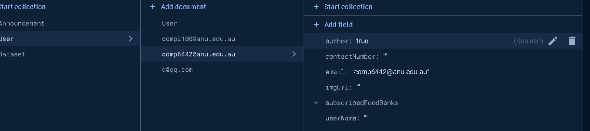
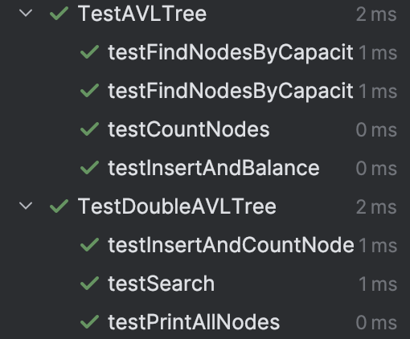
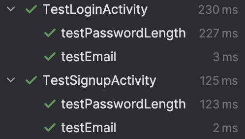
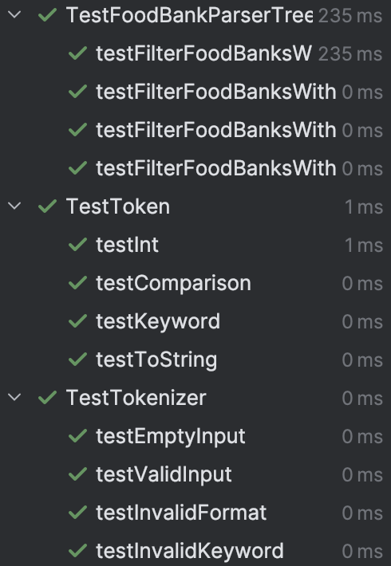
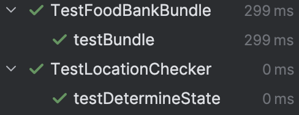
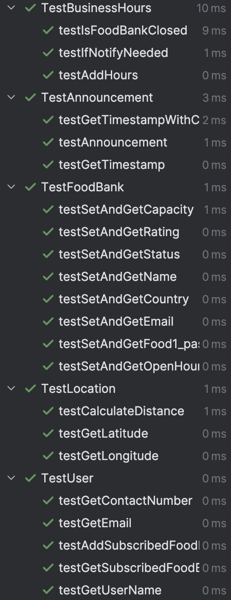

# report

# [G68 - Food Seeker] Report

**api level =34** 

## Table of Contents

1. [Team Members and Roles](about:blank#team-members-and-roles)
2. [Summary of Individual Contributions](about:blank#summary-of-individual-contributions)
3. [Application Description](about:blank#application-description)
4. [Application UML](about:blank#application-uml)
5. [Application Design and Decisions](about:blank#application-design-and-decisions)
6. [Summary of Known Errors and Bugs](about:blank#summary-of-known-errors-and-bugs)
7. [Testing Summary](about:blank#testing-summary)
8. [Implemented Features](about:blank#implemented-features)
9. [Team Meetings](about:blank#team-meetings)
10. [Conflict Resolution Protocol](about:blank#conflict-resolution-protocol)

## Administrative

- Firebase Repository Link: [https://console.firebase.google.com/project/comp2100-6442-4f828/overview](https://console.firebase.google.com/project/comp2100-6442-4f828/overview)
    - Confirm: I have already added comp21006442@gmail.com as a Developer to the Firebase project prior to due date.
- Two user accounts for markers’ access are usable on the app’s APK (do not change the username and password unless there are exceptional circumstances. Note that they are not real e-mail addresses in use):
    - Username: comp2100@anu.edu.au Password: comp2100
    - Username: comp6442@anu.edu.au Password: comp6442

## Team Members and Roles

The key area(s) of responsibilities for each member

| UID | Name | Role |
| --- | --- | --- |
| u7640966 | Zhi Li | Developer |
| u7756543 | Si Chen | Developer |
| u7662582 | Shuhui Yang | Developer |
| u7724610 | Zijian Yang | Developer |
| u7747847 | Haoxuan Xu | Tester, Developer |

## Summary of Individual Contributions

1. **u7640966, Zhi Li** I have 24.5% contribution, as follows:
    - **Code Contribution in the final App**
        - Feature Announcement Show and Post(FB-Persist-extension) - class: [Announcement.java](https://gitlab.cecs.anu.edu.au/u7640966/gp-24s1/-/raw/main/MyApplication/app/src/main/java/com/example/myapplication/model/Announcement.java?ref_type=heads) & [AnnouncementRepository.java](https://gitlab.cecs.anu.edu.au/u7640966/gp-24s1/-/raw/main/MyApplication/app/src/main/java/com/example/myapplication/repository/AnnouncementRepository.java?ref_type=heads) & All classes in folder ‘[home](https://gitlab.cecs.anu.edu.au/u7640966/gp-24s1/-/tree/main/MyApplication/app/src/main/java/com/example/myapplication/ui/home?ref_type=heads)’
        - Feature data graphical - class : [foodBankProfileActivity.java](https://gitlab.cecs.anu.edu.au/u7640966/gp-24s1/-/raw/main/MyApplication/app/src/main/java/com/example/myapplication/ui/foodbankProfile/FoodBankProfileActivity.java?ref_type=heads), method [setupBarChart](https://gitlab.cecs.anu.edu.au/u7640966/gp-24s1/-/blob/main/MyApplication/app/src/main/java/com/example/myapplication/ui/foodbankProfile/FoodBankProfileActivity.java?ref_type=heads#:~:text=private%20void-,setupBarChart,-(Bundle%20bundle))
        - Feature basic FB-auth - class : [LoginActivity.java](https://gitlab.cecs.anu.edu.au/u7640966/gp-24s1/-/raw/main/MyApplication/app/src/main/java/com/example/myapplication/ui/login/LoginActivity.java?ref_type=heads), [SignupActivity.java](https://gitlab.cecs.anu.edu.au/u7640966/gp-24s1/-/raw/main/MyApplication/app/src/main/java/com/example/myapplication/ui/login/SignupActivity.java?ref_type=heads)
        - UI for announcement: [activity_add_announcement](https://gitlab.cecs.anu.edu.au/u7640966/gp-24s1/-/raw/main/MyApplication/app/src/main/java/com/example/myapplication/ui/home/AddAnnouncementActivity.java?ref_type=heads), [fragment_home](https://gitlab.cecs.anu.edu.au/u7640966/gp-24s1/-/raw/main/MyApplication/app/src/main/java/com/example/myapplication/ui/home/HomeFragment.java?ref_type=heads), [fragment_announcement](https://gitlab.cecs.anu.edu.au/u7640966/gp-24s1/-/raw/main/MyApplication/app/src/main/java/com/example/myapplication/ui/home/announcement/AnnouncementFragment.java?ref_type=heads), [announcement_item](https://gitlab.cecs.anu.edu.au/u7640966/gp-24s1/-/raw/main/MyApplication/app/src/main/res/layout/announcement_item.xml?ref_type=heads)
        - Login and Signup UI: [LoginActivity.java](https://gitlab.cecs.anu.edu.au/u7640966/gp-24s1/-/raw/main/MyApplication/app/src/main/java/com/example/myapplication/ui/login/LoginActivity.java?ref_type=heads), [SignupActivity.java](https://gitlab.cecs.anu.edu.au/u7640966/gp-24s1/-/raw/main/MyApplication/app/src/main/java/com/example/myapplication/ui/login/SignupActivity.java?ref_type=heads)
        - Minor UI improvements to all pages, including but not limited to making them all scroll view so that any screen size can use it without the content being pushed out of the screen.
    - **Code and App Design**
        - Repository Design Pattern - class:  [AnnouncementRepository.java](https://gitlab.cecs.anu.edu.au/u7640966/gp-24s1/-/raw/main/MyApplication/app/src/main/java/com/example/myapplication/repository/AnnouncementRepository.java?ref_type=heads)
        - Adapter Design Pattern - class: [AnnouncementAdapter](https://gitlab.cecs.anu.edu.au/u7640966/gp-24s1/-/raw/main/MyApplication/app/src/main/java/com/example/myapplication/ui/home/announcement/AnnouncementAdapter.java?ref_type=heads)
        - MVVM Design Pattern - class: [Announcement.java](https://gitlab.cecs.anu.edu.au/u7640966/gp-24s1/-/raw/main/MyApplication/app/src/main/java/com/example/myapplication/model/Announcement.java?ref_type=heads), [fragment_home,](https://gitlab.cecs.anu.edu.au/u7640966/gp-24s1/-/raw/main/MyApplication/app/src/main/java/com/example/myapplication/ui/home/HomeFragment.java?ref_type=heads) [HomeViewModel](https://gitlab.cecs.anu.edu.au/u7640966/gp-24s1/-/raw/main/MyApplication/app/src/main/java/com/example/myapplication/ui/home/HomeViewModel.java?ref_type=heads)
        - Singleton Design Pattern - class:  [AnnouncementRepository.java](https://gitlab.cecs.anu.edu.au/u7640966/gp-24s1/-/raw/main/MyApplication/app/src/main/java/com/example/myapplication/repository/AnnouncementRepository.java?ref_type=heads)
    - **Others**: (only if significant and significantly different from an “average contribution”)
        - Create Firebase
        - Minor UI improvements to ensure compatibility with different screen sizes.
        - Video
        - Slide
        - Contributed to the final report
2. u7724610, Zijian Yang | have 18.5% contribution, as follows:
    - **Code Contribution in the final App**
        - Feature
            - Data Structure
                - Multi-attribute key AVL tree (by capacity & rating) - class: [DoubleAVLTree.java](https://gitlab.cecs.anu.edu.au/u7640966/gp-24s1/-/raw/main/MyApplication/app/src/main/java/com/example/myapplication/datastructure/DoubleAVLTree.java?ref_type=heads)
                - Standard AVL tree (by id) - class: [AVLTree.java](https://gitlab.cecs.anu.edu.au/u7640966/gp-24s1/-/raw/main/MyApplication/app/src/main/java/com/example/myapplication/datastructure/AVLTree.java?ref_type=heads)
                - Array List (by distance) - [food bank array list](https://gitlab.cecs.anu.edu.au/u7640966/gp-24s1/-/blob/main/MyApplication/app/src/main/java/com/example/myapplication/repository/FoodBankRepository.java?ref_type=heads#L42)
            - Model
                - FoodBank - class: [FoodBank class](https://gitlab.cecs.anu.edu.au/u7640966/gp-24s1/-/raw/main/MyApplication/app/src/main/java/com/example/myapplication/model/FoodBank.java?ref_type=heads)
                - Location - class: [Location class](https://gitlab.cecs.anu.edu.au/u7640966/gp-24s1/-/raw/main/MyApplication/app/src/main/java/com/example/myapplication/model/Location.java?ref_type=heads)
                    - Function `calculateDistance`  - [function](https://gitlab.cecs.anu.edu.au/u7640966/gp-24s1/-/blob/main/MyApplication/app/src/main/java/com/example/myapplication/model/Location.java?ref_type=heads#L47-57)
            - Repository
                - FoodBankRepository - class: [FoodBankRepository.java](https://gitlab.cecs.anu.edu.au/u7640966/gp-24s1/-/raw/main/MyApplication/app/src/main/java/com/example/myapplication/repository/FoodBankRepository.java?ref_type=heads)
                    - Function `readFoodBanks` - [function](https://gitlab.cecs.anu.edu.au/u7640966/gp-24s1/-/blob/main/MyApplication/app/src/main/java/com/example/myapplication/repository/FoodBankRepository.java?ref_type=heads#L144-192)
                    - Function `loadFoodBanks` - [function](https://gitlab.cecs.anu.edu.au/u7640966/gp-24s1/-/blob/main/MyApplication/app/src/main/java/com/example/myapplication/repository/FoodBankRepository.java?ref_type=heads#L197-216)
                    - Interface `DataStatus` - [interface](https://gitlab.cecs.anu.edu.au/u7640966/gp-24s1/-/blob/main/MyApplication/app/src/main/java/com/example/myapplication/repository/FoodBankRepository.java?ref_type=heads#L58-74)
            - Tokenizer
                - Tokenizer - class: [Tokenizer.java](https://gitlab.cecs.anu.edu.au/u7640966/gp-24s1/-/raw/main/MyApplication/app/src/main/java/com/example/myapplication/tokenizer/Tokenizer.java?ref_type=heads)
                - Token - class: [Token.java](https://gitlab.cecs.anu.edu.au/u7640966/gp-24s1/-/raw/main/MyApplication/app/src/main/java/com/example/myapplication/tokenizer/Token.java?ref_type=heads)
            - UI
                - FoodbankFragment - function: [get foodbank live data and sort by distance](https://gitlab.cecs.anu.edu.au/u7640966/gp-24s1/-/blob/main/MyApplication/app/src/main/java/com/example/myapplication/ui/foodbank/FoodbankFragment.java?ref_type=heads#L109-149)
                - FoodbankViewModel - class: [FoodbankViewModel.java](https://gitlab.cecs.anu.edu.au/u7640966/gp-24s1/-/raw/main/MyApplication/app/src/main/java/com/example/myapplication/ui/foodbank/FoodbankViewModel.java?ref_type=heads)
        - Design Pattern
            - MVVM  (Model View ViewModel) - Firebase → FoodBankRepository → FoodbankViewModel → FoodbankFragment
            - Singleton - [FoodBankRepository](https://gitlab.cecs.anu.edu.au/u7640966/gp-24s1/-/blob/main/MyApplication/app/src/main/java/com/example/myapplication/repository/FoodBankRepository.java?ref_type=heads#L96-105)
            - Strategy - [DataStatus](https://gitlab.cecs.anu.edu.au/u7640966/gp-24s1/-/blob/main/MyApplication/app/src/main/java/com/example/myapplication/repository/FoodBankRepository.java?ref_type=heads#L58-74)
            - Observer - [addValueEventListener](https://gitlab.cecs.anu.edu.au/u7640966/gp-24s1/-/blob/main/MyApplication/app/src/main/java/com/example/myapplication/repository/FoodBankRepository.java?ref_type=heads#L149-187)
    - **Code and App Design**
        - Design Pattern and Structure
            - MVVM (Model View ViewModel)
            - Singleton
            - Observer
            - Repository
            - AVLTree
            - Arraylist
        - UI
            - Bottom navigation bar's foodbank area
            - Search box and list view in the foodbank activity
    - **Others**:
        - dataset convert and preprocessing
        - Firebase realtime database maintenance
        - Report writing UML
3. u7662582, Shuhui Yang | have 20% contribution, as follows:
    - **Code Contribution in the final App**
        - UI: [Notification.java](https://gitlab.cecs.anu.edu.au/u7640966/gp-24s1/-/raw/main/MyApplication/app/src/main/java/com/example/myapplication/model/Notification.java?ref_type=heads), [NotificationsFragment.java](https://gitlab.cecs.anu.edu.au/u7640966/gp-24s1/-/raw/main/MyApplication/app/src/main/java/com/example/myapplication/ui/notifications/NotificationsFragment.java?ref_type=heads), [NotificationsViewModel.java](https://gitlab.cecs.anu.edu.au/u7640966/gp-24s1/-/raw/main/MyApplication/app/src/main/java/com/example/myapplication/ui/notifications/NotificationsViewModel.java?ref_type=heads), [NotificstionsAdapter.java](https://gitlab.cecs.anu.edu.au/u7640966/gp-24s1/-/raw/main/MyApplication/app/src/main/java/com/example/myapplication/ui/notifications/NotificstionsAdapter.java?ref_type=heads)
        - Parser: [BusinessHours.java](https://gitlab.cecs.anu.edu.au/u7640966/gp-24s1/-/raw/main/MyApplication/app/src/main/java/com/example/myapplication/parser/BusinessHours.java?ref_type=heads)
        - Feature Announcement Show and Post(FB-Persist-extension) - class: [UserRepository.java](https://gitlab.cecs.anu.edu.au/u7640966/gp-24s1/-/raw/main/MyApplication/app/src/main/java/com/example/myapplication/repository/UserRepository.java?ref_type=heads),
        - Repository: [UserRepository.java](https://gitlab.cecs.anu.edu.au/u7640966/gp-24s1/-/raw/main/MyApplication/app/src/main/java/com/example/myapplication/repository/UserRepository.java?ref_type=heads)
        - Notification: [Notification.java](https://gitlab.cecs.anu.edu.au/u7640966/gp-24s1/-/raw/main/MyApplication/app/src/main/java/com/example/myapplication/model/Notification.java?ref_type=heads), [NotificationsFragment.java](https://gitlab.cecs.anu.edu.au/u7640966/gp-24s1/-/raw/main/MyApplication/app/src/main/java/com/example/myapplication/ui/notifications/NotificationsFragment.java?ref_type=heads), [NotificationsViewModel.java](https://gitlab.cecs.anu.edu.au/u7640966/gp-24s1/-/raw/main/MyApplication/app/src/main/java/com/example/myapplication/ui/notifications/NotificationsViewModel.java?ref_type=heads), [NotificstionsAdapter.java](https://gitlab.cecs.anu.edu.au/u7640966/gp-24s1/-/raw/main/MyApplication/app/src/main/java/com/example/myapplication/ui/notifications/NotificstionsAdapter.java?ref_type=heads)
        - Feature Interact-follow:[FoodBankRecyclerViewInterface.java](https://gitlab.cecs.anu.edu.au/u7640966/gp-24s1/-/raw/main/MyApplication/app/src/main/java/com/example/myapplication/ui/subscribedFoodBanks/FoodBankRecyclerViewInterface.java?ref_type=heads), [SubscribedFoodBanksActivity.java](https://gitlab.cecs.anu.edu.au/u7640966/gp-24s1/-/raw/main/MyApplication/app/src/main/java/com/example/myapplication/ui/subscribedFoodBanks/SubscribedFoodBanksActivity.java?ref_type=heads),
        - Debug & logical improvement [FoodBankRepository.java](https://gitlab.cecs.anu.edu.au/u7640966/gp-24s1/blob/3141c1111a655851fd6a8473c067ac7fe93932aa/MyApplication/app/src/main/java/com/example/myapplication/repository/FoodBankRepository.java#L36-L262)
    - **Code and App Design**
        - Repository Design Pattern - class: [UserRepository.java](https://gitlab.cecs.anu.edu.au/u7640966/gp-24s1/-/raw/main/MyApplication/app/src/main/java/com/example/myapplication/repository/UserRepository.java?ref_type=heads)
        - Adapter Design Pattern - class: [NotificstionsAdapter.java](https://gitlab.cecs.anu.edu.au/u7640966/gp-24s1/-/raw/main/MyApplication/app/src/main/java/com/example/myapplication/ui/notifications/NotificstionsAdapter.java?ref_type=heads)
        - MVVM Design Pattern - class: [Notification.java](https://gitlab.cecs.anu.edu.au/u7640966/gp-24s1/-/raw/main/MyApplication/app/src/main/java/com/example/myapplication/model/Notification.java?ref_type=heads), [NotificationsFragment.java](https://gitlab.cecs.anu.edu.au/u7640966/gp-24s1/-/raw/main/MyApplication/app/src/main/java/com/example/myapplication/ui/notifications/NotificationsFragment.java?ref_type=heads), [NotificationsViewModel.java](https://gitlab.cecs.anu.edu.au/u7640966/gp-24s1/-/raw/main/MyApplication/app/src/main/java/com/example/myapplication/ui/notifications/NotificationsViewModel.java?ref_type=heads)
        - Singleton Design Pattern - class: [UserRepository.java](https://gitlab.cecs.anu.edu.au/u7640966/gp-24s1/-/raw/main/MyApplication/app/src/main/java/com/example/myapplication/repository/UserRepository.java?ref_type=heads)
    - **Others**:
        - Debug the Multithreading problem
        - Report writing
4. u7756543, Si Chen | have 18.5% contribution, as follows:
    - **Code Contribution in the final App**
        - Data Structure
            - ArrayList -  In [FoodBankFragment.java](https://gitlab.cecs.anu.edu.au/u7640966/gp-24s1/-/blob/main/MyApplication/app/src/main/java/com/example/myapplication/ui/foodbank/FoodbankFragment.java?ref_type=heads), store the data returned from the backend in an ArrayList format, and filter the data in the ArrayList based on search criteria.
        - UI
            - Foodbank fragment page - Function:  The UI components for filtering, input, and searching in [FoodBankFragment.java](https://gitlab.cecs.anu.edu.au/u7640966/gp-24s1/-/blob/main/MyApplication/app/src/main/java/com/example/myapplication/ui/foodbank/FoodbankFragment.java?ref_type=heads), and the function for reading and returning specific data based on user content and filtering criteria.
            - Foodbank profile page - Function: UI components for the top navigation bar and map in [FoodBankProfile.java](https://gitlab.cecs.anu.edu.au/u7640966/gp-24s1/-/blob/main/MyApplication/app/src/main/java/com/example/myapplication/ui/foodbankProfile/FoodBankProfileActivity.java?ref_type=heads). Logic related to accepting and processing data passed from other activities.
            - Login page - Function: Request location permissions from users in [LoginActivity](https://gitlab.cecs.anu.edu.au/u7640966/gp-24s1/-/blob/main/MyApplication/app/src/main/java/com/example/myapplication/ui/login/LoginActivity.java?ref_type=heads) and handle the results of permission acquisition.
        - Parser
            - Parser to analyze tokens - Class: [FoodBankParserTree.java](https://gitlab.cecs.anu.edu.au/u7640966/gp-24s1/-/blob/main/MyApplication/app/src/main/java/com/example/myapplication/parser/FoodBankParserTree.java?ref_type=heads)
        - Adapter
            - An adapter that display foodbanks in the form of ListView - Class:  [FoodBankAdapterNew.java](https://gitlab.cecs.anu.edu.au/u7640966/gp-24s1/-/blob/main/MyApplication/app/src/main/java/com/example/myapplication/adapter/FoodBankAdapterNew.java?ref_type=heads)
        - Utils
            - Util to transfer foodbank data between activities - Class:  [FoodBankBundle.java](https://gitlab.cecs.anu.edu.au/u7640966/gp-24s1/-/blob/main/MyApplication/app/src/main/java/com/example/myapplication/utils/FoodBankBundle.java?ref_type=heads)
            - Util to find the state of a position - Class: [LocationChecker.java](https://gitlab.cecs.anu.edu.au/u7640966/gp-24s1/-/blob/main/MyApplication/app/src/main/java/com/example/myapplication/utils/LocationChecker.java?ref_type=heads)
    - **Code and App Design**
        - Design Pattern and Structure
            - Adapter pattern
        - UI
            - Top navigation bar in foodbank profile page
            - Search box, states selection filter and foodbank ListView
        - **Others**:
            - report writing
5. u7747847, Haoxuan Xu | have 18.5% contribution, as follows:
    - **Code Contribution in the final App**
        - UI for logo activity: [LogoActivity.java](https://gitlab.cecs.anu.edu.au/u7640966/gp-24s1/-/raw/main/MyApplication/app/src/main/java/com/example/myapplication/ui/login/LogoActivity.java?ref_type=heads)
        - UI for login and signup activity: [LoginActivity.java](https://gitlab.cecs.anu.edu.au/u7640966/gp-24s1/-/raw/main/MyApplication/app/src/main/java/com/example/myapplication/ui/login/LoginActivity.java?ref_type=heads), [SignupActivity.java](https://gitlab.cecs.anu.edu.au/u7640966/gp-24s1/-/raw/main/MyApplication/app/src/main/java/com/example/myapplication/ui/login/SignupActivity.java?ref_type=heads)
        - Check login and signup format:[LoginActivity.java](https://gitlab.cecs.anu.edu.au/u7640966/gp-24s1/-/raw/main/MyApplication/app/src/main/java/com/example/myapplication/ui/login/LoginActivity.java?ref_type=heads), [SignupActivity.java](https://gitlab.cecs.anu.edu.au/u7640966/gp-24s1/-/raw/main/MyApplication/app/src/main/java/com/example/myapplication/ui/login/SignupActivity.java?ref_type=heads)
        - Data stream to simulate announcements and user’s signup based on FireBase and FireStore: [DataUploadService.java](https://gitlab.cecs.anu.edu.au/u7640966/gp-24s1/-/raw/main/MyApplication/app/src/main/java/com/example/myapplication/DataStream/DataUploadService.java?ref_type=heads), [UploadReceiver.java](https://gitlab.cecs.anu.edu.au/u7640966/gp-24s1/-/raw/main/MyApplication/app/src/main/java/com/example/myapplication/DataStream/UploadReceiver.java?ref_type=heads), [Uploader.java](https://gitlab.cecs.anu.edu.au/u7640966/gp-24s1/-/raw/main/MyApplication/app/src/main/java/com/example/myapplication/DataStream/Uploader.java?ref_type=heads)
        - Unit testing
            - Test for classes:
                - Announcement, FoodBank, Location, Notification, User and BusinessHours: [TestAnnouncement.java](https://gitlab.cecs.anu.edu.au/u7640966/gp-24s1/-/raw/main/MyApplication/app/src/test/java/com/example/myapplication/TestAnnouncement.java?ref_type=heads), [TestFoodBank.java](https://gitlab.cecs.anu.edu.au/u7640966/gp-24s1/-/raw/main/MyApplication/app/src/test/java/com/example/myapplication/TestFoodBank.java?ref_type=heads), [TestLocation.java](https://gitlab.cecs.anu.edu.au/u7640966/gp-24s1/-/raw/main/MyApplication/app/src/test/java/com/example/myapplication/TestLocation.java?ref_type=heads), [TestNotification.java,](https://gitlab.cecs.anu.edu.au/u7640966/gp-24s1/-/raw/main/MyApplication/app/src/test/java/com/example/myapplication/TestNotification.java?ref_type=heads) [TestUser.java](https://gitlab.cecs.anu.edu.au/u7640966/gp-24s1/-/raw/main/MyApplication/app/src/test/java/com/example/myapplication/TestUser.java?ref_type=heads), [TestBusinessHours.java](https://gitlab.cecs.anu.edu.au/u7640966/gp-24s1/-/raw/main/MyApplication/app/src/test/java/com/example/myapplication/TestBusinessHours.java?ref_type=heads)
            - Test for login and signup logic:[TestLoginActivity.java](https://gitlab.cecs.anu.edu.au/u7640966/gp-24s1/-/raw/main/MyApplication/app/src/test/java/com/example/myapplication/TestLoginActivity.java?ref_type=heads), [TestSignupActivity.java](https://gitlab.cecs.anu.edu.au/u7640966/gp-24s1/-/raw/main/MyApplication/app/src/test/java/com/example/myapplication/TestSignupActivity.java?ref_type=heads)
            - Test for Token, Tokenizer and Parser:[TestToken.java](https://gitlab.cecs.anu.edu.au/u7640966/gp-24s1/-/raw/main/MyApplication/app/src/test/java/com/example/myapplication/TestToken.java?ref_type=heads), [TestTokenizer.java](https://gitlab.cecs.anu.edu.au/u7640966/gp-24s1/-/raw/main/MyApplication/app/src/test/java/com/example/myapplication/TestTokenizer.java?ref_type=heads), [TestFoodBankParserTree.java](https://gitlab.cecs.anu.edu.au/u7640966/gp-24s1/-/raw/main/MyApplication/app/src/test/java/com/example/myapplication/TestFoodBankParserTree.java?ref_type=heads)
            - Test for data structure:
                - AVL tree, Double AVL tree:[TestAVLTree.java](https://gitlab.cecs.anu.edu.au/u7640966/gp-24s1/-/raw/main/MyApplication/app/src/test/java/com/example/myapplication/TestAVLTree.java?ref_type=heads), [TestDoubleAVLTree.java](https://gitlab.cecs.anu.edu.au/u7640966/gp-24s1/-/raw/main/MyApplication/app/src/test/java/com/example/myapplication/TestDoubleAVLTree.java?ref_type=heads)
            - Test for utils: FoodBankBundle, Location Checker:[TestFoodBankBundle.java](https://gitlab.cecs.anu.edu.au/u7640966/gp-24s1/-/raw/main/MyApplication/app/src/test/java/com/example/myapplication/TestFoodBankBundle.java?ref_type=heads), [TestLocationChecker.java](https://gitlab.cecs.anu.edu.au/u7640966/gp-24s1/-/raw/main/MyApplication/app/src/test/java/com/example/myapplication/TestLocationChecker.java?ref_type=heads)
        - **Code and App Design**
            - Single Responsibility Principle: All the unit tests.
            - **Observer Pattern:** [DataUploadService.java](https://gitlab.cecs.anu.edu.au/u7640966/gp-24s1/-/raw/main/MyApplication/app/src/main/java/com/example/myapplication/DataStream/DataUploadService.java?ref_type=heads)
            - MVVM Design Pattern: [LoginActivity.java](https://gitlab.cecs.anu.edu.au/u7640966/gp-24s1/-/raw/main/MyApplication/app/src/main/java/com/example/myapplication/ui/login/LoginActivity.java?ref_type=heads), [SignupActivity.java](https://gitlab.cecs.anu.edu.au/u7640966/gp-24s1/-/raw/main/MyApplication/app/src/main/java/com/example/myapplication/ui/login/SignupActivity.java?ref_type=heads)
        - **Others**:
            - Create data file: Create 3000 instances of food bank, use python to generate any attribute the app need(include gps info, contact info, status, open_hours, food, rating—25 attributes in total)[dataset.csv](https://gitlab.cecs.anu.edu.au/u7640966/gp-24s1/-/raw/main/MyApplication/app/src/main/dataset/dataset.csv?ref_type=heads)
            - Firebase realtime database maintenance
            - Contributed to report

## Application Description

**Food Seeker** is a dedicated Android application developed in Android Studio, designed to assist individuals and organizations in locating food banks efficiently and providing vital information on foodbank services. This app gives users access to an extensive database of over 3000 foodbanks, including details like operational hours, capacity, remaining food, contact information, and addresses, all managed through Firebase. Users can also update their profiles, including changing their username, profile image, and contact number, and manage subscriptions to foodbanks. The app not only offers specific details for each foodbank but also features real-time notifications and announcements, making it a valuable resource for users and charitable organizations alike. The app's intuitive design includes various fragments such as profile, home, search, and foodbank details, each linked through a central navigation bar and powered by a robust MVVM and repository design pattern.

### Application Use Cases and or Examples

**Target Users:**

- Individuals facing financial, health, and various other challenges.
- Charitable organizations and groups seeking a centralized information source for collaboration

**User interaction flow:** 

1. **Login/Sign Up:**
    - Upon opening the app, users are greeted with the login screen. Users can either log in or sign up. Both actions involve storing or retrieving user information from Firebase using Firebase Auth and Firestore (Firestore stores detailed personal information).
2. **Main Activity and Fragments:**
    - The app has a main activity with fragments such as home, foodbank, notification, and profile. The fragments serve as subpages of the main activity.
3. **Home Fragment:**
    - After logging in, users are directed to the home fragment where they can see a RecyclerView displaying announcements from users marked as authors. Announcements are sorted by publication time.
    - Each item in the RecyclerView represents an announcement and can be clicked to view its details.
    - Hot to set to author
    
    
    
    - Authors see an "add announcement" button in the home fragment. Newly added 
    announcements are updated in real-time  for all users.
    - The announcement system has the potential to evolve into a social media-like feature by adding a reply system to each announcement item.
4. **Foodbank Fragment:**
    - The foodbank fragment displays a list view of foodbanks sorted by their proximity to the user's device location.
    - Each list item can be clicked to view detailed information about the foodbank.
    - A search bar allows users to search foodbanks using specific grammar (e.g., input name or 'capacity/rating ><= integer'). Search results are sorted by distance.
    - A filter option allows users to display foodbanks based on their state (e.g., ACT, NSW, etc.).
5. **Foodbank Details:**
    - Each foodbank detail page includes operational details, a Google Map view, and a bar chart representing the remaining quantities of five different types of food.
    - Users can subscribe to foodbanks to receive notifications.
6. **Notification Fragment:**
    - Displays recent notifications and updates from subscribed foodbanks, including opening and closing times.
7. **Profile Fragment:**
    - Displays personal information such as username, email address, contact number, and profile picture. Users can update their username and contact number, with changes automatically uploaded to Firebase Firestore.
    - Users can update their profile picture, which will also be updated in Firestore.
    - Users can view their subscribed foodbanks and have the option to unsubscribe or view detailed information about each foodbank.

### Scenario 1: Individual User

**Situation**: Sarah is experiencing financial difficulties and needs to find nearby foodbanks to support her and her family.

- Sarah opens the app and logs in using her credentials.
- She sees the Home fragment, which displays the latest announcements about foodbank events and operational changes.
- Sarah navigates to the Foodbank fragment using the navigation bar.
- She uses the filter to search for foodbanks within her state.
- Sarah selects a foodbank from the list and views its details, noting the address, operational hours, and remaining food capacity.
- The page also includes a Google Map view and a bar chart displaying the quantities of different types of food available.
- Sarah subscribes to the foodbank to receive notifications about its opening and closing times.
- Sarah updates her profile picture and contact information to ensure she receives all updates.

### Scenario 2: Charitable Organization

1. **Admin Login and Posting Announcements**:
    - **David**, an admin at Hope Community Center, logs into the app using his credentials.
    - He is directed to the Home fragment, where he can see all announcements.
    - David clicks on the “Add Announcement” button to post about an upcoming food drive event.
    - He enters details such as the event date, time, location, and special instructions. This announcement is immediately visible to all users.
2. **Volunteers and Community Engagement**:
    - **Emily**, a volunteer, logs into the app and sees David’s announcement about the food drive.
    - She clicks on the announcement to view more details and marks the event in her calendar.
    - Emily uses the Foodbank fragment to find the nearest foodbanks participating in the event. She uses the filter to select her state and views the list of foodbanks.
    - She selects a foodbank and subscribes to it to receive notifications about the event day.
    - On the day of the event, Emily receives a notification reminding her of the food drive’s opening time.
    - The notification includes the foodbank’s address and operational hours, ensuring she arrives on time to help.
    - After the event, Emily updates her profile information, adding her contact number for future communications.
    - She checks her subscribed foodbanks and decides to continue supporting the one she volunteered at during the food drive.
    - Emily can easily manage her subscriptions, ensuring she stays informed about upcoming events and opportunities to volunteer.

### Application UML


[Download uml.png from GitLab](https://gitlab.cecs.anu.edu.au/u7640966/gp-24s1/-/raw/main/items/uml.png?inline=false)

## Code Design and Decisions

### Data Structures

1. **Array List**
    - **Objective:**
        - Used for storing **`Announcement`** objects retrieved from Firebase Firestore for the announcements feature.
        - Used to store subscrbed food bank
        - Used to store notifications
        - When fetching food bank data from the Realtime Database, it will first be stored as an array list.
    - **Code Locations:**
        - Defined in **`AnnouncementRepository`** class, method **`[loadAnnouncements](https://gitlab.cecs.anu.edu.au/u7640966/gp-24s1/-/blob/main/MyApplication/app/src/main/java/com/example/myapplication/repository/AnnouncementRepository.java?ref_type=heads#:~:text=*/-,private%20void%20loadAnnouncements()%20%7B,%7D,-/**)`**:
        - [FoodBankRepository - readFoodBanks()](https://gitlab.cecs.anu.edu.au/u7640966/gp-24s1/-/blob/main/MyApplication/app/src/main/java/com/example/myapplication/repository/FoodBankRepository.java?ref_type=heads#L163-195)
    - **Reasons:**
        - **Dynamic Resizing:** **`ArrayList`** automatically resizes to accommodate new **`Announcement`** objects, which is useful since the number of announcements can change frequently.
        - **Efficient Iteration:** **`ArrayList`** provides quick and efficient iteration over elements, which is essential for processing and converting Firestore documents to **`Announcement`** objects.
        - **Simplicity:** **`ArrayList`** is straightforward to use and integrates well with the rest of the Java Collections Framework, making it easy to manage and manipulate the list of announcements.
        - In FoodBankRepository**,** When the search function is not activated (default view of the food bank list), the food bank list needs to be sorted by "distance from the user." Using an array list for storing and displaying is more convenient as it can be shown directly in the list view without conversion. Additionally, sorting by distance has a relatively low time complexity.
2. **Multi-attribute key AVL tree**
    - **Objective**: Used for efficiently handling complex multi-condition searches in the food bank search feature, such as `capacity > 5 AND rating < 5`.
    - **Code Locations**:
        - [DoubleAVLTree](https://gitlab.cecs.anu.edu.au/u7640966/gp-24s1/-/blob/main/MyApplication/app/src/main/java/com/example/myapplication/datastructure/DoubleAVLTree.java?ref_type=heads#L36)
    - **Reasons**:
        - **Efficient Multi-condition Queries**:
            - In our app, users often search for food banks with multiple constraints. A double AVL tree allows us to handle these complex queries more efficiently than a single tree structure or a list.
            - For instance, when a user searches for food banks with `capacity > 5 AND rating < 5`, the first AVL tree quickly narrows down the search to food banks with `capacity > 5`. Then, within this subset, the second AVL tree efficiently finds those with `rating < 5`.
        - **Optimized Query Complexity**:
            - Using a single AVL tree would require multiple passes or complex operations to handle multiple conditions, leading to higher time complexity. Specifically, you would first traverse the tree to find all nodes satisfying the `capacity > 5` condition, which could take O(N) time in the worst case. Then, you would need to filter this subset again to satisfy the `rating < 5` condition, adding another O(M) complexity where M is the size of the subset. This results in an overall time complexity of O(N + M), which could be inefficient for larger datasets. The double AVL tree structure reduces this complexity by performing the first condition check in O(log N) time and the second condition check within the subset in O(log M) time, resulting in a more efficient overall query performance.
        - **Balanced Structure**:
            - AVL trees maintain a balanced structure, ensuring consistent and predictable performance for insertions, deletions, and lookups. Critical for our app's performance, especially as the number of food banks changes.
        - **Scalability**:
            - As the number of food banks grows, the double AVL tree ensures that the search performance remains optimal. The tree's self-balancing property prevents degradation in performance, allowing the app to handle a larger dataset without significant slowdowns.
        - **Memory Efficiency**:
            - AVL trees are also memory efficient compared to other data structures like hash tables or lists, which can be crucial for mobile applications where memory resources are limited. The balanced nature of AVL trees minimizes the space complexity, ensuring that the app remains lightweight and responsive.
        - **Ease of Implementation**:
            - Using a double AVL tree provides a clear and maintainable structure for handling multi-condition searches. This clarity simplifies the implementation and maintenance of the codebase, making it easier for developers to understand and extend the functionality in the future.
    1. **AVL Tree**
        - **Objective**: When fetching food bank data from the Realtime Database, an AVL tree will be simultaneously built using the IDs as keys. Methods will be provided for user-related functions to call, allowing food bank instances to be found quickly by their IDs.
        - **Code Locations**:
            - [AVLTree](https://gitlab.cecs.anu.edu.au/u7640966/gp-24s1/-/blob/main/MyApplication/app/src/main/java/com/example/myapplication/datastructure/AVLTree.java?ref_type=heads#L12)
        - Reasons:
            - **Fast Lookups**:
                - Using an AVL tree for storing food bank instances by their IDs ensures O(log N) time complexity for search operations. This allows users to quickly find specific food banks without delays, improving the overall user experience.
            - **Balanced Structure**:
                - The AVL tree maintains a balanced structure by ensuring that the height difference between the left and right subtrees of any node is at most one. This balance guarantees that the tree remains efficient for all operations, including insertions, deletions, and lookups.
            - **Scalability**:
                - As the number of food bank entries grows, the AVL tree ensures that the performance of search operations remains optimal. The self-balancing property of AVL trees prevents performance degradation, allowing the application to handle a large dataset efficiently.
            - **Memory Efficiency**:
                - AVL trees are more memory-efficient compared to other data structures like hash tables, which require additional space for managing collisions. The compact nature of AVL trees makes them suitable for mobile applications where memory resources are limited.
            - **Simplified Implementation**:
                - Implementing an AVL tree for ID-based lookups simplifies the codebase by providing a clear and maintainable structure. This clarity reduces the complexity of the code, making it easier for developers to understand and maintain the application.

### Design Patterns

1. **MVVM Pattern**
    - **Objective:** To separate the business logic and data layers from the user interface (UI) of the application, enhancing the modularity, scalability, and testability of the app.
    - **Code Locations:** It is the main(overall) design patter used. Implemented in various classes across the application. For example, ViewModel classes manage UI-related data for the Profile, Home, Search, and Foodbank fragments.
    - **Reasons:**
        1. **Decoupling UI and Business Logic:** Allows changes in the backend logic without affecting the frontend, making the codebase more maintainable.
        2. **Ease of Testing:** Simplifies unit testing of business logic without interacting with UI components.
        3. **Enhanced Control over Lifecycle Management:** ViewModel persists data across configuration changes, preventing data loss during device rotations.
        4. **Improved Data Management:** LiveData within ViewModel facilitates data updates in a lifecycle-aware manner, ensuring UI components only observe relevant data changes.
        5. **Resource Efficiency:** Reduces memory leaks and manages resources more efficiently by observing data changes only when the component is in a valid state.
2. **Repository Pattern**
    - **Objective:** To abstract the access to data sources from the rest of the application, providing a clean API for data access to the rest of the application and thus simplifying data handling.
    - **Code Locations:** Repository classes handle data interactions and are used across ViewModel components to fetch and store data from Firebase.
    - **Reasons:**
        1. **Data Source Abstraction:** Encapsulates the logic for accessing data sources, allowing easy modification of data layers without affecting other parts of the application.
        2. **Consistency in Data Handling:** Provides a consistent approach to fetching data from various sources (Firebase, local cache), which simplifies data synchronization.
        3. **Improved Scalability:** Facilitates scaling the application by adding new data sources or changing existing ones without significant changes to the ViewModel.
        4. **Reduction of Boilerplate Code:** Centralizes data fetching and caching logic in one location, reducing redundancy and boilerplate code across the app.
        5. **Singleton Usage:** Utilizing singleton patterns within repositories ensures that instances of repositories are unique and consistent throughout the application, managing resources efficiently.
3. **Singleton Pattern with Thread Lock**
    - **Objective:** To ensure a single instance of the `FoodBankRepository` is created and accessed throughout the application while providing thread-safe access to shared resources.
    - **Code Locations:** The singleton and thread lock implementations are found within the `FoodBankRepository` class, ensuring safe and consistent data access across multiple fragments.
    - **Reasons:**
        1. **Resource Sharing:** Ensures that only one instance of `FoodBankRepository` exists, allowing all fragments to access and modify the same data, maintaining consistency.
        2. **Thread Safety:** The use of a thread lock (`ReentrantLock`) guarantees that data operations are thread-safe, preventing data corruption and ensuring that only one thread can access the critical section at a time.
        3. **Data Consistency:** By locking data operations, the repository ensures that data remains consistent and is not modified concurrently by multiple threads.
        4. **Performance Optimization:** Reduces memory overhead and initialization time by avoiding multiple instances of the repository, thus optimizing performance.
        5. **Centralized Data Management:** Concentrates data handling logic in one location, simplifying maintenance and updates to the data access logic.
        6. **Improved Scalability:** Facilitates easier scaling of the application by managing data access in a centralized, consistent manner.
4. **Adapter Pattern**
    - **Objective:** By adding an adapter to convert food bank data into a format that can be displayed in a list view.
    - **Code Locations:** `FoodBankAdapterNew`
    - **Reasons:**
        1. **Enhanced class reusability:** Even if the `FoodBank` data and UI components in the existing system are not directly compatible, developers can reuse existing code through adapters without rebuilding the entire system.
        2. **Reduce system component coupling:** Listview can use any type of data source through the adapter, and any changes in the data source will not affect the implementation of Listview. Adapter reduces the coupling between UI components and data processing logic, and improves the flexibility and maintainability of the system.
        3. **Improved system scalability:** When new data types or view representations need to be introduced, the adapter pattern allows developers to just add a new adapter class without modifying existing data sources or view logic.
5. **Strategy**
    - Objective: The Strategy pattern is used to define a family of algorithms, encapsulate each one, and make them interchangeable. It allows the algorithm to vary independently from the clients that use it. In the **`FoodBankRepository`**, the Strategy pattern is used to handle different data status operations, such as inserting, updating, and deleting data from the Firebase database.
    - Code Locations: [FoodBankRepository - DataStatus](https://gitlab.cecs.anu.edu.au/u7640966/gp-24s1/-/blob/main/MyApplication/app/src/main/java/com/example/myapplication/repository/FoodBankRepository.java?ref_type=heads#L58-74)
    - Reasons:
        - The **`DataStatus`** interface defines a strategy for handling different data statuses such as data inserted, data updated, and data deleted.
        - This interface is implemented by anonymous classes to provide specific strategies for each operation. This allows the **`FoodBankRepository`** to be flexible and easily extensible, as new strategies can be added without modifying the existing code.
        - By using the Strategy pattern, the repository can handle different data statuses in a modular way, making the code easier to maintain and extend.
6. **Observer**
    - Objective: The Observer pattern is used to define a one-to-many dependency between objects so that when one object changes state, all its dependents are notified and updated automatically. In the **`FoodBankRepository`**, the Observer pattern is used to listen for changes in the Firebase database and update the application state accordingly.
    - Code Locations: [FoodBankRepository - addValueEventListener](https://gitlab.cecs.anu.edu.au/u7640966/gp-24s1/-/blob/main/MyApplication/app/src/main/java/com/example/myapplication/repository/FoodBankRepository.java?ref_type=heads#L149-187)
    - Reasons:
        - The **`addValueEventListener`** method sets up a listener that observes changes in the Firebase database.
        - When the data in the database changes, the **`onDataChange`** method is triggered, notifying the **`FoodBankRepository`** of the change. This demonstrates the core idea of the Observer pattern: one object (the Firebase database) changes state, and the observer (the repository) is notified to update accordingly.
        - This pattern is particularly useful in real-time applications, such as this one, where data changes frequently and the UI or other components need to be updated automatically to reflect the current state of the data.

### Parser

### Grammar(s)

The grammar for the **`Tokenizer`** and **`FoodBankParserTree`** is designed to parse tokens related to **`rating`** and **`capacity`** criteria for filtering **`FoodBank`** objects. The grammar can be summarized with the following production rules:

Production Rules:

```
<FilterCriteria> ::= <Keyword> <Comparison> <Value>
<Keyword> ::= "rating" | "capacity"
<Comparison> ::= ">" | "<" | "="
<Value> ::= <integer>
```

Advantages of the design:

1. **Simplicity**: The grammar is straightforward, making it easy to understand and implement.
2. **Flexibility**: It allows for different combinations of criteria (e.g., **`rating > 4`**, **`capacity < 100`**), enabling versatile filtering capabilities.
3. **Scalability**: New criteria (e.g., distance) can be added easily by extending the grammar and the tokenizer/parser logic.

### Tokenizers and Parsers

### **The way tokenizer and parser been used:**

- **Tokenizers**: "In **`FoodBankFragment.java`**, users search for foodbanks by entering information in the search box.  The tokenizer is used to break down the input string into manageable tokens that represent keywords, comparisons, and values.
- **Parsers**: The parser processes the tokens to extract filtering criteria and perform searches on the **`DoubleAVLTree`** to retrieve matching **`FoodBank`** objects.

### The way **tokenizer and parser** are built:

- **Tokenizers**:
    - The tokenizer splits the input string into tokens based on predefined delimiters (e.g., spaces, commas).
    - Each token is categorized as a **`Keyword`**, **`Comparison`**, or **`Value`**.
- **Parsers**:
    - The parser takes the list of tokens and iterates through them in groups of three (**`<Keyword> <Comparison> <Value>`**).
    - It validates the tokens and converts the comparison and value tokens into appropriate indices and values.
    - The parser then calls specific search methods on the **`DoubleAVLTree`** based on the parsed criteria.

### **Advantages of the designs:**

- **Modularity**: The separation of tokenization and parsing ensures that each component has a single responsibility, making the code easier to maintain and extend.
- **Error Handling**: The tokenizer and parser can independently handle errors and invalid inputs, providing more robust and user-friendly feedback.
- **Reusability**: The tokenizer and parser can be reused or adapted for similar filtering tasks with minimal changes.
- **Efficiency**: By breaking down the parsing process into clear steps, the design allows for efficient processing of input criteria and quick retrieval of results from the tree.

## Implemented Features

### Basic Features

1. [LogIn]. Description
    - Code: [LoginActivity.java](https://gitlab.cecs.anu.edu.au/comp2100/group-project/ga-23s2/-/blob/main/items/media/_examples/Dummy.java)
    - Description of feature: Login and Signup are the first activities. Users register by entering a valid email address and password, or log in directly with an already registered account.
    - Description of your implementation: Based on firebase authentication, the `LoginActivity` class handles user authentication, providing a user login interface and using Firebase for authentication. Its main methods include: `onCreate` to initialise the activity and request location permissions, `isValidEmail` to validate email format, `isLengthLessThan6` to check password length, `containUpper` to check if the password contains uppercase letters(which is removed according to instructions), `onClick` to handle login button clicks and perform authentication, `updateUI` to update the UI based on the user's authentication status, and `onRequestPermissionsResult` to handle permission request results.
2. [DataFiles]. 3000 instances in total. Use python to create the data set required for this app (since the python-related code has nothing to do with this course, the code is not pushed to gitlab). This data set contains detailed information of multiple locations. Each piece of information includes attributes such as a Food Bank's address, contact information, business hours, food inventory, capacity, and ratings: index, id, unit_type (building type), street, suburb, region, country, postcode, lat (latitude of Food Bank), lon (longitude of Food Bank), doe (time when Food Bank was established), tel (contact number), prefix (email prefix), suffix (email suffix) , email, name, status (business status of Food Bank), open_hours (business hours), food1_pasta, food2_bread, food3_milk, food4_pie, food5_vet (storage of five kinds of food), capacity (capacity of people that Food Bank can accommodate), and rating (score).
    - Code to the Data File [FoodBankRepository.java](https://gitlab.cecs.anu.edu.au/u7640966/gp-24s1/-/raw/main/MyApplication/app/src/main/java/com/example/myapplication/repository/FoodBankRepository.java?ref_type=heads), [activity_food_bank_profile.xml](https://gitlab.cecs.anu.edu.au/u7640966/gp-24s1/-/raw/main/MyApplication/app/src/main/res/layout/activity_food_bank_profile.xml?ref_type=heads), [foodbankinfo_list.xml](https://gitlab.cecs.anu.edu.au/u7640966/gp-24s1/-/raw/main/MyApplication/app/src/main/res/layout/foodbankinfo_list.xml?ref_type=heads)
    - Link to the Firebase repo: [dataset_on_firebase](https://console.firebase.google.com/project/comp2100-6442-4f828/firestore/databases/-default-/data/~2FAnnouncement~2F0OCLRhWuZhJBF1ZwxaP0)(Due to security and privacy concerns, this link may only be opened by invited users)
    - Link to the Gitlab repo: [dataset.csv](https://gitlab.cecs.anu.edu.au/u7640966/gp-24s1/-/blob/main/MyApplication/app/src/main/dataset/dataset.csv?ref_type=heads), [dataset.json](https://gitlab.cecs.anu.edu.au/u7640966/gp-24s1/-/blob/main/MyApplication/app/src/main/dataset/dataset.json?ref_type=heads)
3. [LoadShowData]. 
    - Code:  [FoodBankProfile.java](https://gitlab.cecs.anu.edu.au/u7640966/gp-24s1/-/blob/main/MyApplication/app/src/main/java/com/example/myapplication/ui/foodbankProfile/FoodBankProfileActivity.java?ref_type=heads), [FoodBankFragment.java](https://gitlab.cecs.anu.edu.au/u7640966/gp-24s1/-/blob/main/MyApplication/app/src/main/java/com/example/myapplication/ui/foodbank/FoodbankFragment.java?ref_type=heads), [FoodBankViewModel.java,](https://gitlab.cecs.anu.edu.au/u7640966/gp-24s1/-/blob/main/MyApplication/app/src/main/java/com/example/myapplication/ui/foodbank/FoodbankViewModel.java?ref_type=heads) [fragment_foodbank.xml](https://gitlab.cecs.anu.edu.au/u7640966/gp-24s1/-/blob/main/MyApplication/app/src/main/res/layout/fragment_foodbank.xml?ref_type=heads), [activity_food_bank_profile.xml](https://gitlab.cecs.anu.edu.au/u7640966/gp-24s1/-/blob/main/MyApplication/app/src/main/res/layout/activity_food_bank_profile.xml?ref_type=heads)
    - Description of feature:
        
        This application displays data on the user interface by writing layout files and assigning values to different UI components.
        
    - Description of your implementation:
        
        In  [FoodBankFragment.java](https://gitlab.cecs.anu.edu.au/u7640966/gp-24s1/-/blob/main/MyApplication/app/src/main/java/com/example/myapplication/ui/foodbank/FoodbankFragment.java?ref_type=heads), data is loaded and displayed as follows: The fragment initializes UI components (**`EditText`**, **`Button`**, **`ListView`**, and **`Spinner`**) and retrieves the user's GPS location.  [FoodBankViewModel.java](https://gitlab.cecs.anu.edu.au/u7640966/gp-24s1/-/blob/main/MyApplication/app/src/main/java/com/example/myapplication/ui/foodbank/FoodbankViewModel.java?ref_type=heads) loads the data from Firebase and returns the list of food banks to the  [FoodBankFragment.java](https://gitlab.cecs.anu.edu.au/u7640966/gp-24s1/-/blob/main/MyApplication/app/src/main/java/com/example/myapplication/ui/foodbank/FoodbankFragment.java?ref_type=heads).
        
        Each food bank's distance from the user's location is calculated, and the food banks are sorted by distance and displayed in the **`ListView`** using a custom adapter. Users can search for food banks by name or criteria, with results filtered and updated in the **`ListView`**. Clicking an item starts **`FoodBankProfileActivity`**, passing the selected food bank's details via a **`Bundle`**. The layout includes a **`TextView`** for instructions, a **`LinearLayout`** for search controls, and a **`ListView`** for displaying food banks.
        
        The  [FoodBankProfile.java](https://gitlab.cecs.anu.edu.au/u7640966/gp-24s1/-/blob/main/MyApplication/app/src/main/java/com/example/myapplication/ui/foodbankProfile/FoodBankProfileActivity.java?ref_type=heads) and its layout file display detailed information about a food bank. The activity initializes UI components such as `TextViews`, `ImageViews`, a `WebView`, and a `BarChart`, using data from a `Bundle`. The `TextViews` show the food bank's name, phone number, email, state, open hours, capacity, distance, foundation date, postcode, rate, and location. The `WebView` displays the food bank's location on Google Maps, and the `BarChart` visualizes food quantities. Event handling is implemented for back, share, and subscribe buttons. The layout file structures these components within a scrollable `ScrollView`, ensuring all elements are accessible on the screen.
        
4. [DataStream]. The data flow is used to simulate the behavior of announcement publishing and user registration respectively.
    - Code: [DataUploadService.java](https://gitlab.cecs.anu.edu.au/u7640966/gp-24s1/-/raw/main/MyApplication/app/src/main/java/com/example/myapplication/DataStream/DataUploadService.java?ref_type=heads), [UploadReceiver.java](https://gitlab.cecs.anu.edu.au/u7640966/gp-24s1/-/raw/main/MyApplication/app/src/main/java/com/example/myapplication/DataStream/UploadReceiver.java?ref_type=heads), [Uploader.java](https://gitlab.cecs.anu.edu.au/u7640966/gp-24s1/-/raw/main/MyApplication/app/src/main/java/com/example/myapplication/DataStream/Uploader.java?ref_type=heads), [AnnouncementSimulator.java](https://gitlab.cecs.anu.edu.au/u7640966/gp-24s1/-/raw/main/MyApplication/app/src/main/java/com/example/myapplication/AnnouncementSimulator.java?ref_type=heads)
    - Features:
        
        By uploading to firebase and monitoring the information on firebase in real time through livedata, the announcement publishing behavior is implemented.
        
        Reading a csv locally as user information simulates the behavior of user registration every n seconds through Authentication on firebase.
        
    - Description of your implementation:
        - The `DataUploadService` class is a simulator for automatically registering a new user every thirty seconds, uploading the user's account and password information to Firebase. Its main methods include: `DataUploadService` constructor to initialize Firebase instances and start the periodic data upload, `startPeriodicDataUpload` to set up a recurring task for data upload every thirty seconds, `readDataFromStreamAndUpload` to read data from a CSV file and upload it, `readDataFromCSV` to read the CSV file, `createUserAndUploadData` to create a new user and upload their data to Firestore, `uploadDataToFirestore` to upload user data to Firestore, and `stopPeriodicDataUpload` to stop the periodic data upload task. The `DataModel` class is used to represent the data structure for user information.
        - The `AnnouncementSimulator` class simulates uploading user announcements to Firebase Firestore at regular intervals. It initializes with a provided context, starts the simulation by scheduling tasks to run immediately and every 10 seconds, and handles uploading announcements. The `uploadAnnouncement` method manages the actual uploads, including an immediate and a delayed upload, and stops the scheduler after a maximum number of announcements. The `simulateUserAnnouncement` method creates and uploads an announcement with the current time, displaying a toast message to indicate success or failure.
5. [Search]. 
    - Code: [FoodBankParserTree.java](https://gitlab.cecs.anu.edu.au/u7640966/gp-24s1/-/blob/main/MyApplication/app/src/main/java/com/example/myapplication/parser/FoodBankParserTree.java?ref_type=heads), [Tokenizer.java,](https://gitlab.cecs.anu.edu.au/u7640966/gp-24s1/-/raw/main/MyApplication/app/src/main/java/com/example/myapplication/tokenizer/Tokenizer.java?ref_type=heads) [Token.java](https://gitlab.cecs.anu.edu.au/u7640966/gp-24s1/-/raw/main/MyApplication/app/src/main/java/com/example/myapplication/tokenizer/Token.java?ref_type=heads), [FoodBankFragment.java](https://gitlab.cecs.anu.edu.au/u7640966/gp-24s1/-/blob/main/MyApplication/app/src/main/java/com/example/myapplication/ui/foodbank/FoodbankFragment.java?ref_type=heads), [AVLtree.java](https://gitlab.cecs.anu.edu.au/u7640966/gp-24s1/-/blob/main/MyApplication/app/src/main/java/com/example/myapplication/datastructure/AVLTree.java?ref_type=heads)
    - Description of feature:
        
        This application supports users to search by entering a name or an expression, with names containing numbers and letters. The relevant variables for the expression search are `capacity` and `rating`. Users must input in the format such as `capacity > 10`. After completing their input, users should click the 'search' button, and the search results will be displayed on the application's interface. Any other input formats will not be accepted by the application.
        
    - Description of your implementation:
        
        The application uses the `'EditText'` provided by Android to implement the user input field. When the user completes the input and clicks the 'search' button, the application evaluates the content of the input. If the input does not contain special characters, it is considered a name. The application will then iterate through the food bank list and return data where the name contains the input string.
        
        If the input string contains special characters, it is considered an expression and will be converted into a token list using [Tokenizer.java](https://gitlab.cecs.anu.edu.au/u7640966/gp-24s1/-/raw/main/MyApplication/app/src/main/java/com/example/myapplication/tokenizer/Tokenizer.java?ref_type=heads). Next, the application calls [FoodBankParserTree.java](https://gitlab.cecs.anu.edu.au/u7640966/gp-24s1/-/blob/main/MyApplication/app/src/main/java/com/example/myapplication/parser/FoodBankParserTree.java?ref_type=heads), which uses different AVL tree traversal methods based on the tokens to retrieve food banks that meet the user's input conditions. The results are combined into a list and displayed on the search interface.
        

### Custom Features

Feature Category: Search-related features

1. [Search-Filter] Sort and filter a list of items returned from searches, with the use of suitable UI
components. (easy)
* Code:  [FoodBankFragment.java](https://gitlab.cecs.anu.edu.au/u7640966/gp-24s1/-/blob/main/MyApplication/app/src/main/java/com/example/myapplication/ui/foodbank/FoodbankFragment.java?ref_type=heads), [LocationChecker.java](https://gitlab.cecs.anu.edu.au/u7640966/gp-24s1/-/blob/main/MyApplication/app/src/main/java/com/example/myapplication/utils/LocationChecker.java?ref_type=heads)
* Description of your implementation: In the  [FoodBankFragment.java](https://gitlab.cecs.anu.edu.au/u7640966/gp-24s1/-/blob/main/MyApplication/app/src/main/java/com/example/myapplication/ui/foodbank/FoodbankFragment.java?ref_type=heads), we added a spinner component to implement a filter function. This component is a dropdown list with options that include the names of various states in Australia. When the application detects that the user has made a selection, it will call the **`.stateSelector()`**method in [LocationChecker.java](https://gitlab.cecs.anu.edu.au/u7640966/gp-24s1/-/blob/main/MyApplication/app/src/main/java/com/example/myapplication/utils/LocationChecker.java?ref_type=heads). This method will construct a new list based on the current search results, retaining only the results from the state selected by the user. The application will then display the results filtered by the user's selection.

Feature Category: Firebase Integration

1. [FB-Auth] Use Firebase to implement User Authentication/Authorisation. (easy)
* Code: [Class LoginActivity, entire file](https://gitlab.cecs.anu.edu.au/u7640966/gp-24s1/-/blob/main/MyApplication/app/src/main/java/com/example/myapplication/ui/login/LoginActivity.java?ref_type=heads) and [Class SignupActivity, entire file](https://gitlab.cecs.anu.edu.au/u7640966/gp-24s1/-/blob/main/MyApplication/app/src/main/java/com/example/myapplication/ui/login/SignupActivity.java?ref_type=heads)
* Description of your implementation:LoginActivity resplonsible for authentication users, The SignupActivity handles new user registration.
2. [FB-Persist-extension] Use Firebase to implement User Authentication/Authorisation. (easy)
Feature Category: Greater Data Usage, Handling and Sophistication 
3. [Data-Profile]Create a Profile Page for Users or any Entities, which contains a media file (image, animation (e.g., gif), video). (easy)
* Code: [Class LoginActivity, entire file](https://gitlab.cecs.anu.edu.au/u7640966/gp-24s1/-/blob/main/MyApplication/app/src/main/java/com/example/myapplication/ui/login/LoginActivity.java?ref_type=heads) and [Class SignupActivity, entire file](https://gitlab.cecs.anu.edu.au/u7640966/gp-24s1/-/blob/main/MyApplication/app/src/main/java/com/example/myapplication/ui/login/SignupActivity.java?ref_type=heads)
* Description of your implementation: Users can update their phone number, name, and profile picture in real-time, and these changes will be directly synced to Firebase. Glide package were used to show the profile image 
4. [Data-Graphical]Create a Graphical report viewer to see a report of some useful data from your app. No marks will be awarded if the report is non-graphical. (medium)
* Code: [Class LoginActivity, entire file](https://gitlab.cecs.anu.edu.au/u7640966/gp-24s1/-/blob/main/MyApplication/app/src/main/java/com/example/myapplication/ui/login/LoginActivity.java?ref_type=heads) and [Class SignupActivity, entire file](https://gitlab.cecs.anu.edu.au/u7640966/gp-24s1/-/blob/main/MyApplication/app/src/main/java/com/example/myapplication/ui/login/SignupActivity.java?ref_type=heads)
* Description of your implementation: In the foodbank details, an Android package was used to create a bar chart of the remaining food for a specific foodbank.
5. [Data-GPS] Use GPS information based on location data in your App. (easy) 
* Code: [Class LoginActivity, entire file](https://gitlab.cecs.anu.edu.au/u7640966/gp-24s1/-/blob/main/MyApplication/app/src/main/java/com/example/myapplication/ui/login/LoginActivity.java?ref_type=heads) and [Class SignupActivity, entire file](https://gitlab.cecs.anu.edu.au/u7640966/gp-24s1/-/blob/main/MyApplication/app/src/main/java/com/example/myapplication/ui/login/SignupActivity.java?ref_type=heads)
* Description of your implementation: When the user enters the application, check if the application has permission to access the user's location. If it does not, use Android's built-in **`.requestPermission()`** method to request location access via a pop-up. After obtaining the permission, application can get the user's geographic coordinates using the **`.getSystemService()`**  method from **`LocationManager`**  class in Android.

Feature Category: User Interactivity

1. [Interact-Follow] The ability to ‘follow’ items. There must be a section that presents all the items followed by a user, grouped, and ordered. [stored in-memory] (medium)
* Code: [Class LoginActivity, entire file](https://gitlab.cecs.anu.edu.au/u7640966/gp-24s1/-/blob/main/MyApplication/app/src/main/java/com/example/myapplication/ui/login/LoginActivity.java?ref_type=heads) and [Class SignupActivity, entire file](https://gitlab.cecs.anu.edu.au/u7640966/gp-24s1/-/blob/main/MyApplication/app/src/main/java/com/example/myapplication/ui/login/SignupActivity.java?ref_type=heads)
* Description of your implementation: 
    
    The **`UserRepository`** class implements the food bank subscription feature by storing a list of subscribed food banks for each user and updating this list in both local memory and Firestore. Cloud FireStore only handles a list of strings which represents food bank ids, they will be instantiate locally in FoodBankRepository by traversing all FoodBank instances when triggering the loadUser() method in the Login activity. Subscribing to a food bank will synchronise by adding the food bank ID into the List<String> to store in Firebase as well as  saving the instance locally.
    

### Surprise Features

1. **AnnouncementRepository**
    1. **Singleton Pattern Implementation:**
        
        [AnnouncementRepository Singleton](https://gitlab.cecs.anu.edu.au/u7640966/gp-24s1/-/commit/f6576651f18f31293215317048674acf083d5ead)
        
        - **Previous Issue:** The class did not implement the Singleton pattern, risking multiple instances.
        - **Change:** Added a static volatile instance variable and synchronized the **`getInstance`** method to ensure thread safety and single instance creation.
        - [https://gitlab.cecs.anu.edu.au/u7640966/gp-24s1/-/commit/86d02bb5ca8b97f16196b00dc1e8ab4bc6abce79](https://gitlab.cecs.anu.edu.au/u7640966/gp-24s1/-/commit/86d02bb5ca8b97f16196b00dc1e8ab4bc6abce79)
        - **Reason:** The Singleton pattern ensures that only one instance of `AnnouncementRepository` exists, preventing resource contention and improving efficiency. It provides a consistent data state across the application, ensuring all components access the same data. Additionally, the thread-safe implementation guarantees safe access in concurrent environments, avoiding race conditions and data corruption.
2. **Remove hard coding:**
    - **Previous Issue:**  In the early development stages, **`foodbankFragment.java`** and **`foodprofile.java`** extensively used hard coding. ([https://gitlab.cecs.anu.edu.au/u7640966/gp-24s1/-/commit/349da228fe6c905e0ac1d3a1c9f73f9f754a4202](https://gitlab.cecs.anu.edu.au/u7640966/gp-24s1/-/commit/349da228fe6c905e0ac1d3a1c9f73f9f754a4202))
    - **Change:** All hard-coded variables have been individually defined and stored . ([https://gitlab.cecs.anu.edu.au/u7640966/gp-24s1/-/commit/cdf35e671bba984be26293c19f32c2af5064318f](https://gitlab.cecs.anu.edu.au/u7640966/gp-24s1/-/commit/cdf35e671bba984be26293c19f32c2af5064318f))
    - **Reason:**  Avoiding hard coding enhances code reusability. For instance, if a function uses hard-coded values, it might only be effective under specific circumstances. By passing these values as parameters, the function can be utilized in a broader range of scenarios.   As the application transitions between different deployment environments (such as development, testing, and production), hard-coded values may need to vary based on the environment. Using configuration files or environment variables allows for easy adjustments to these values without altering the code.
3. **FoodBankRepository**
    1. **Singleton Pattern Implementation:**
        - **Previous Issue:**
            - The application had multiple instances of **`FoodBankRepository`**, leading to potential data inconsistency and excessive resource usage.
        - **Change:**
            - Implemented the Singleton pattern to ensure only one instance of **`FoodBankRepository`** exists.
        - **Code Position:**
            - Before: [commit 96dc1408](https://gitlab.cecs.anu.edu.au/u7640966/gp-24s1/-/commit/96dc140801f0bb5c29c22e4db41be24cb8d6d8d2#dfc7ad3afc573426198https://gitlab.cecs.anu.edu.au/u7640966/gp-24s1/-/commit/96dc140801f0bb5c29c22e4db41be24cb8d6d8d2#dfc7ad3afc57342619818c677c19418b2f287c4a_3_1318c677c19418b2f287c4a_3_13)
            - After: [latest version](https://gitlab.cecs.anu.edu.au/u7640966/gp-24s1/-/blob/main/MyApplication/app/src/main/java/com/example/myapplication/repository/FoodBankRepository.java?ref_type=heads#L103)
        - **Reason:**
            - The Singleton pattern ensures that a class has only one instance and provides a global point of access to it. This prevents the creation of multiple instances, which can lead to inconsistent data states and inefficient resource usage. The Singleton pattern is particularly useful in managing shared resources, such as database connections.
    2. **Lock Implementation:**
        - **Previous Issue:**
            - Concurrent access to the **`readFoodBanks`** method could lead to data inconsistency and race conditions.
        - **Change:**
            - Added a **`ReentrantLock`** to ensure thread-safe operations when accessing and modifying the **`foodBanks`** list and AVL trees.
        - **Code Position:**
            - Before: [commit 96dc1408](https://gitlab.cecs.anu.edu.au/u7640966/gp-24s1/-/commit/96dc140801f0bb5c29c22e4db41be24cb8d6d8d2#dfc7ad3afc573426198https://gitlab.cecs.anu.edu.au/u7640966/gp-24s1/-/commit/96dc140801f0bb5c29c22e4db41be24cb8d6d8d2#dfc7ad3afc57342619818c677c19418b2f287c4a_3_1318c677c19418b2f287c4a_3_13)
            - After: [](https://gitlab.cecs.anu.edu.au/u7640966/gp-24s1/-/blob/main/MyApplication/app/src/main/java/com/example/myapplication/repository/FoodBankRepository.java?ref_type=heads#L103)[latest version](https://gitlab.cecs.anu.edu.au/u7640966/gp-24s1/-/blob/main/MyApplication/app/src/main/java/com/example/myapplication/repository/FoodBankRepository.java?ref_type=heads#L164)
        - **Reason:**
            - Using a lock ensures that critical sections of code are executed by only one thread at a time, preventing data corruption and ensuring data consistency. This is particularly important when performing read and write operations in a multi-threaded environment, such as when handling Firebase database updates asynchronously.
4. **User Repository**
    1. Asynchronous loading optimised
        - **Previous Issue:**
            - The user is instantiated before the FoodBank instances are loaded because Firebase reads data asynchronously. Performing operations on the user before all FoodBank instances are instantiated can cause errors.
            - [UserRepository Asynchronous loading optimised](https://gitlab.cecs.anu.edu.au/u7640966/gp-24s1/-/commit/42bdfd1d0e69a549c63778b669b173676f7495dc)
        - **Change:**
            - Added a **`CompletableFuture.runAsync(() -> { })`** to ensure the user is instantiated only after all FoodBank instances have been fully loaded.
            - [CompletableFuture.runAsync](https://gitlab.cecs.anu.edu.au/u7640966/gp-24s1/-/commit/2632c6fa58a5127b37bc19abb9dfdaa00a6e1af1)
        - **Code Position:** [loadUser()](https://gitlab.cecs.anu.edu.au/u7640966/gp-24s1/blob/7a44825ec09fbb83db2d47e8168ba671f473a972/MyApplication/app/src/main/java/com/example/myapplication/repository/UserRepository.java#L102-L137)
        - **Reason:**
            - This change ensures that any user-related operations are performed only after all required FoodBank data is available, preventing potential errors caused by asynchronous data loading. This approach enhances data consistency and reliability within the application.

---

## Summary of Known Errors and Bugs

1. **GPS***:*
    - If the app is granted  permissions but GPS data is not set in the virtual machine(gpsinfo = null), clicking the `foodbank` fragment will cause the app to crash.
    - If the user did not grant Google Maps permission to access GPS information before opening the app for some virtual machine, clicking the **`foodbank`** fragment will result in a crash, as Google Maps is used inside the food bank detail page.
2. **Sign up**
    1. Although new users are set to default as non-authors after signup, they can still see the "Add Announcement" button. It is only on their second login that the button will no longer be visible.
3. **foodbank list**
    1. If the phone's performance is insufficient, it may not load all the foodbank data instances immediately. This can potentially cause a crash when clicking "Subscribe to Foodbank." Therefore, please first click on the Foodbank fragment and ensure that you can see the list of foodbanks before attempting to subscribe.
4. **google map**
    1. After changing the virtual location on some virtual machines, you must open Google Maps once for the app to update the current location. Therefore, if you notice that the distance calculation has not changed after modifying the virtual location, please close the app and open Google Maps once, then  sign in again.
5. **Notification**
    1. The notification can only be sent based on the business hour without its operating status .

## Testing Summary

1. **Tests for Data Structure**
    - Code: AVL tree, Double AVL tree: [TestAVLTree.java](https://gitlab.cecs.anu.edu.au/u7640966/gp-24s1/-/raw/main/MyApplication/app/src/test/java/com/example/myapplication/TestAVLTree.java?ref_type=heads), [TestDoubleAVLTree.java](https://gitlab.cecs.anu.edu.au/u7640966/gp-24s1/-/raw/main/MyApplication/app/src/test/java/com/example/myapplication/TestDoubleAVLTree.java?ref_type=heads)
    - Screenshot:
        
        
        
    - Number of test cases: 7
    - Code coverage: 90%
    - Types of tests created and descriptions: The data structure used in this project is mainly AVL tree. DoubleAVLTree extended from AVL tree can store two keys at the same time. Trees are used to store data and support searches. The main purpose here is to test the function of the tree.
2. **Test for Login and Signup logic:**
    - Code: [TestLoginActivity.java](https://gitlab.cecs.anu.edu.au/u7640966/gp-24s1/-/raw/main/MyApplication/app/src/test/java/com/example/myapplication/TestLoginActivity.java?ref_type=heads), [TestSignupActivity.java](https://gitlab.cecs.anu.edu.au/u7640966/gp-24s1/-/raw/main/MyApplication/app/src/test/java/com/example/myapplication/TestSignupActivity.java?ref_type=heads)
    - Screenshot:
        
        
        
    - Number of test cases: 4
    - Code coverage: 100%, just for logic
    - Types of tests created and descriptions:When a user logs in or registers, a logic needs to be used to check whether the user's email format is legal and whether the password length meets the requirements, so as to return prompt information to the user. Here is a certain test of the logic of these tests.
3. Test for Token, Tokenizer and Parser:
    - Code: [TestToken.java](https://gitlab.cecs.anu.edu.au/u7640966/gp-24s1/-/raw/main/MyApplication/app/src/test/java/com/example/myapplication/TestToken.java?ref_type=heads), [TestTokenizer.java](https://gitlab.cecs.anu.edu.au/u7640966/gp-24s1/-/raw/main/MyApplication/app/src/test/java/com/example/myapplication/TestTokenizer.java?ref_type=heads), [TestFoodBankParserTree.java](https://gitlab.cecs.anu.edu.au/u7640966/gp-24s1/-/raw/main/MyApplication/app/src/test/java/com/example/myapplication/TestFoodBankParserTree.java?ref_type=heads)
    - Screenshot:
        
        
        
    - Number of test cases: 12
    - Code coverage: 90%
    - Types of tests created and descriptions:When reading user input, the functions of Tokenizer and Parser are essential and very critical. The functions of the Token class, Tokenizer and all Parser are tested here to ensure that the functions can be executed correctly. In addition, FoodBankParserTree is working for filter feature.
4. **Test for utils: FoodBankBundle, Location Checker:**
    - Code: [TestFoodBankBundle.java](https://gitlab.cecs.anu.edu.au/u7640966/gp-24s1/-/raw/main/MyApplication/app/src/test/java/com/example/myapplication/TestFoodBankBundle.java?ref_type=heads), [TestLocationChecker.java](https://gitlab.cecs.anu.edu.au/u7640966/gp-24s1/-/raw/main/MyApplication/app/src/test/java/com/example/myapplication/TestLocationChecker.java?ref_type=heads)
    - Screenshot:
        
        
        
    - Number of test cases: 2
    - Code coverage: 100%
    - Types of tests created and descriptions:FoodBankBundle is a utils used to put data into a Bundle to facilitate the use of subsequent functions. LocationCheker scope filters use an algorithm to determine which region of Australia a certain GPS belongs to.
5. **Test for classes: Announcement, FoodBank, Location, Notification, User and BusinessHours**
    - Code: [TestAnnouncement.java](https://gitlab.cecs.anu.edu.au/u7640966/gp-24s1/-/raw/main/MyApplication/app/src/test/java/com/example/myapplication/TestAnnouncement.java?ref_type=heads), [TestFoodBank.java](https://gitlab.cecs.anu.edu.au/u7640966/gp-24s1/-/raw/main/MyApplication/app/src/test/java/com/example/myapplication/TestFoodBank.java?ref_type=heads), [TestLocation.java](https://gitlab.cecs.anu.edu.au/u7640966/gp-24s1/-/raw/main/MyApplication/app/src/test/java/com/example/myapplication/TestLocation.java?ref_type=heads), [TestNotification.java,](https://gitlab.cecs.anu.edu.au/u7640966/gp-24s1/-/raw/main/MyApplication/app/src/test/java/com/example/myapplication/TestNotification.java?ref_type=heads) [TestUser.java](https://gitlab.cecs.anu.edu.au/u7640966/gp-24s1/-/raw/main/MyApplication/app/src/test/java/com/example/myapplication/TestUser.java?ref_type=heads), [TestBusinessHours.java](https://gitlab.cecs.anu.edu.au/u7640966/gp-24s1/-/raw/main/MyApplication/app/src/test/java/com/example/myapplication/TestBusinessHours.java?ref_type=heads)
    - Screenshot:
        
        
        
    - Number of test cases: 22
    - Code coverage: 100%
    
    Types of tests created and descriptions:This includes testing a large number of classes and methods inside them. The name of the test is readable, and you can clearly know what function is being tested through the test name.
    

Generally speaking, this test conducted a relatively complete Unit Test. A rough and conservative estimate is that the test coverage is above 90%. Many loopholes were also discovered during the testing process and were fixed with timely feedback.

## Team Management

### Meetings Records

All meeting minutes are recorded in ‘Notion’ and has been updated to the project later

- Your meetings should also have a reasonable date spanning across Week 6 to 11.*
- *[Team Meeting 1](https://gitlab.cecs.anu.edu.au/u7640966/gp-24s1/-/blob/main/items/media/meeting1.md?ref_type=heads)*
- [Team Meeting 2](https://gitlab.cecs.anu.edu.au/u7640966/gp-24s1/-/blob/main/items/media/meeting2.md?ref_type=heads)
- [Team Meeting 3](https://gitlab.cecs.anu.edu.au/u7640966/gp-24s1/-/blob/main/items/media/meeting3.md?ref_type=heads)
- [Team Meeting 4](https://gitlab.cecs.anu.edu.au/u7640966/gp-24s1/-/blob/main/items/media/meeting4.md?ref_type=heads)
- **Team members primarily communicate through informal meetings of two to three people and online discussions, which are more efficient in terms of finishing individually assigned jobs.**

### Conflict Resolution Protocol

- Recognise the conflict and agree to address it constructively
- Encourage involved parties to discuss the issue privately first, try to understand the difference and benefits of other members’ idea
- If conflict cannot be resolved privately, assign a neutral team member to lead the discussion
    - Each party states their view without interruption
    - Brainstorm the decide on a solution collectively
    - Choose the best solution through discussion
    - If no consensus is reached, conduct a group-wide vote by raising hands.
- Develop an action plan and define who is responsible for each action item related to the problem
- Schedule regular check-ins to monitor progress.
- Document the conflict, resolution steps, and final solution for future reference
- If conflict remains unsolved, seek help from an external tutor/mentor.